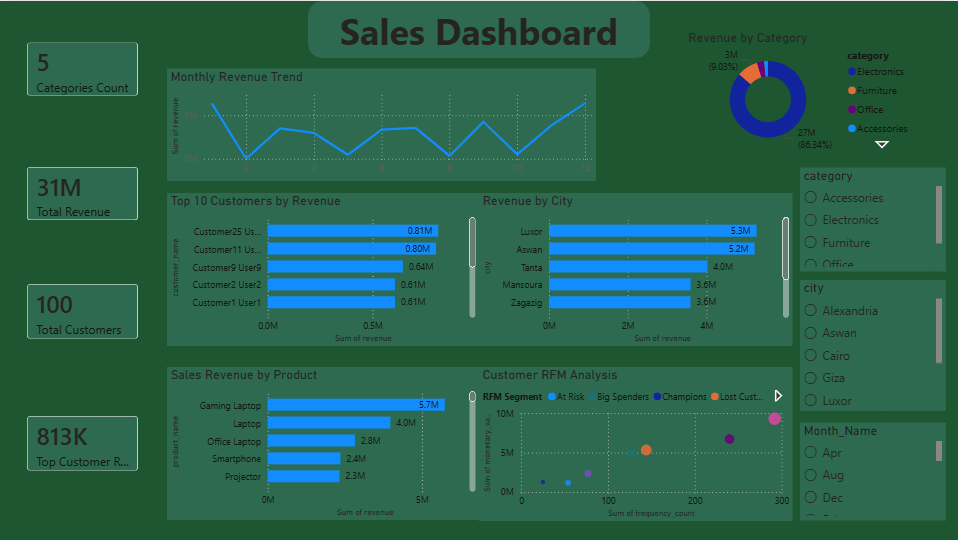

# Ecommerce Analytics Dashboard

## Project Overview

This project analyzes ecommerce sales data using SQL and Power BI.

The dashboard provides insights into:

- Revenue trends
- Product performance
- Customer segmentation
- Geographic sales distribution

---

## Dashboard KPIs

- Total Revenue
- Total Customers
- Revenue by Category
- Top Customers
- Top Products
- Revenue by City

---

## Dashboard Preview

### Dashboard

---

## Tools Used

- MySQL
- Power BI
- Excel
- GitHub

---

## Key Insights

- Electronics generated the majority of revenue.
- A small number of customers contributed a large share of sales.
- Revenue varied significantly by city.
- RFM analysis identified high-value and inactive customers.

  ## Related Project

[SQL Ecommerce Analytics Project](https://github.com/fadyibrahim987-code/SQL-Ecommerce-Analytics)

---

## 👤 Author

**Fady Ibrahim** — Operations & Business Analyst 
[LinkedIn](https://www.linkedin.com/in/fady-ibrahim-b343013b1) · [GitHub Portfolio](https://github.com/Fadyibrahim-analyst)

